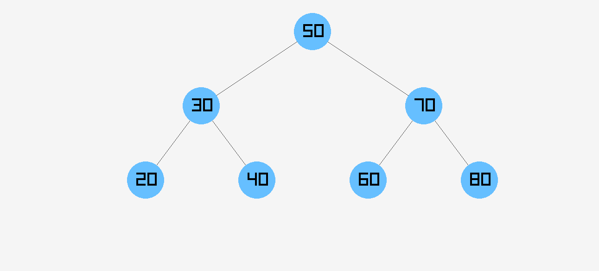
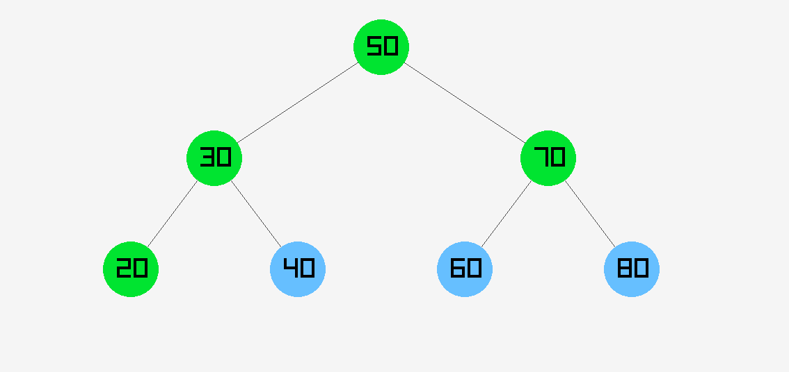

# Binary Tree Traversal Visualizer 🌲

This project is a graphical visualizer for Breadth-First Search (BFS) traversal on a binary tree, built using C and [raylib](https://www.raylib.com/). It allows you to visually explore how nodes are visited in BFS order by clicking a button.

---

## 🔍 Features

- Build and render a binary tree using a simple structure
- BFS traversal with animation (nodes light up green one by one)
- Visual layout of nodes and edges using 2D graphics
- "Start BFS" button to trigger the animation
- Cross-platform support (macOS, Linux, Windows)

---

## 🖼️ Demo



Or an animated demo:



---

## 🛠 Build Instructions

### ✅ Prerequisites

Install **raylib** for your OS.


### macOS
Install Raylib via Homebrew:

```bash
brew install raylib
make 
./main 
```

### Windows(MYSYS2) 
Install Raylib via Pacman 

```bash
pacman -S mingw-w64-x86_64-gcc mingw-w64-x86_64-raylib
make 
./main 
```

### Linux(Debian/Ubuntu)


```bash
sudo apt update
sudo apt install build-essential libraylib-dev
make
./main
```